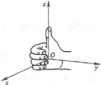
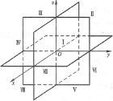
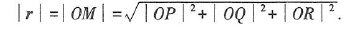
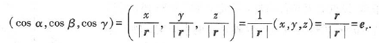
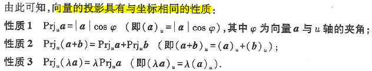

# 第8章 向量代数与空间解析几何

## 第一节 向量及其线性运算

### 简单概念

> **矢量：** 既有大小又有方向的量  
> **两向量的夹角：** 规定以不超过π的角度为向量a，b的夹角,记作$\widehat{(\boldsymbol{a}, \boldsymbol{b})}$  
> **向量平行：** 终点和公共起点应在一条直线  
> **向量共面：** 起点放在同一点，如果k个终点和公共起点在一个平面上，就称这k个向量共面  
> 向量加减：省略  
> **向量b平行于a的充分必要条件是：** 存在唯一的实数λ，使$b = \lambda a$  
> **空间直角坐标系**与**卦限**

### 向量的模、方向角、投影

#### 向量的模

向量的模就是向量的大小，即为起点到终点的距离

- **向量的模:** 

#### 方向角和方向余弦

非零向量$r$与三条坐标轴的夹角$α，β，γ$，称为向量$r$的方向角

$\cos\alpha，\cos\beta，\cos\gamma$称为向量$r$的方向余弦.
以向量$r$的方向余弦为坐标的向量就是与$r$同方向的单位向量$e_r$. 并由此可得
$$
\cos^2\alpha + \cos^2\beta + \cos^2\gamma = 1
$$

#### 投影

## 第二节 数量积 向量积 混合积

### 简单概念（数量积）

> **数量积：** $\vec{a} \cdot \vec{b} = \bigl| \vec{a}\bigr| \bigl| \vec{b}\bigr| \cos\widehat{(\boldsymbol{a}, \boldsymbol{b})}$  
> **向量$a,b$的夹角余弦公式** $\cos\widehat{(\boldsymbol{a},\boldsymbol{b})} = \frac{\boldsymbol{a} \cdot \boldsymbol{b}}{\bigl|\boldsymbol{a}\bigr| \, \bigl|\boldsymbol{b}\bigr|}$  
> **数量积的坐标表达式：** $a \cdot b=a_x b_x+a_y b_y+a_z b_z$

### 向量的向量积

**这部分主要是以下公式理解即可**

- $\vec c$垂直于$\vec a$与$\vec b$所决定的平面，$\vec c$的模$\bigl| c \bigr| = \bigl| a \bigr|  \bigl| b \bigr| \sin \theta$,此时的$\vec c$被称为$\vec a$与$\vec b$的**向量积**，记作$\vec c = \vec a \times \vec b$
- $\vec a \times \vec a = 0$
- $\vec a \times \vec b = 0$是$\vec a \mathop{//} \vec b$的**充要条件**
- (1) $\vec a \times \vec b = - \vec b \times \vec a$
- (2) $(\vec a +\vec b)\times \vec c = \vec a \times \vec c + \vec b \times \vec c$
- (3) $(\lambda \vec{a}) \times \vec{b} = \vec{a} \times (\lambda \vec{b}) = \lambda (\vec{a} \times \vec{b}) \quad (\lambda \text{ 为数})$  
- **向量积的坐标表达式** $\vec{a} \times \vec{b} = (a_y b_z - a_z b_y)\,\vec{i} + (a_z b_x - a_x b_z)\,\vec{j} + (a_x b_y - a_y b_x)\,\vec{k}$,该式可写成三阶行列式
$$
\vec{a} \times \vec{b} =
\begin{vmatrix}
\vec{i} & \vec{j} & \vec{k} \\
a_x & a_y & a_z \\
b_x & b_y & b_z
\end{vmatrix}
$$

### 向量的混合积

**向量$\vec{a}、\vec{b}、\vec{c}$的混合积定义为**
$(\vec{a} \times \vec{b}) \cdot \vec{c}$，记作$[\vec{a}\vec{b}\vec{c}]。$

**混合积的几何意义：**

- 向量的混合积的绝对值表示以向量$\vec{a}，\vec{b}，\vec{c}$内棱的平行六面体的体积  
- 其中，如果向量$\vec{a}，\vec{b}，\vec{c}$组成右手系，那么混合积符号为正  
- 反之，如果向量$\vec{a}，\vec{b}，\vec{c}$组成左手系，那么混合积符号为负  

另外，当混合积为0时向量$\vec{a}，\vec{b}，\vec{c}$共面，反之，向量$\vec{a}，\vec{b}，\vec{c}$可以构成以他们为棱的平行六面体

## 第三节 平面及其方程

### 曲面方程与空间曲线方程

#### 曲面方程:

如果$F(x,y,z)=0$为曲面$S$的**方程**，则有

- (1) $S$上的任意一点的坐标都满足该方程
- (2) 不在$S$上的点的坐标都不满足方程

同时称$S$为该方程的**图形**

#### 空间曲线的方程：

**空间曲线**可看作两曲面$S_1,S_2$的交线。设两曲面的方程分别为
$$
F(x,y,z)=0,G(x,y,z)=0
$$
交线为$C$，则C上任一点的坐标都满足**方程组**
$$
\begin{cases}
F(x, y, z) = 0, \\
G(x, y, z) = 0.
\end{cases}
$$
该方程组被称为**空间曲线$C$的方程**,曲线$C$被称为方程组的**图形**

### 平面方程与平面的夹角

#### 平面的点法式方程

**法向量：** 垂直于平面的任一非零向量，平面的的任一向量均与此向量平行  
**点法式方程** 由法向量垂直可推出$$A(x-x_0) + B(y-y_0) + C(z-z_0) = 0$$平面上的任一点坐标均满足该方程。其中$A,B,C$和$x_0,y_0,z_0$是由法向量$\vec n = (A,B,C)$和平面某点$M_0(x_0,y_0,z_0)$决定的  

#### 平面的一般方程

任何一个三元一次方程 $$Ax+By+Cz+D=0$$都表示一个平面，这就是**平面的一般式方程**。其中，$x,y,z$ 的系数组成的向量 $\boldsymbol{n}=(A,B,C)$ 就是该平面的一个法向量。

#### 平面的截距式方程

将平面在 $x, y, z$ 轴上的截距点 $(a,0,0), (0,b,0), (0,0,c)$ 代入一般式方程 $Ax+By+Cz+D=0$，解出系数并化简，即得**平面的截距式方程**：$$\frac{x}{a} + \frac{y}{b} + \frac{z}{c} = 1$$
> 注意！截距式方程要求三个截距都存在且均不为 0

#### 两平面的夹角

两平面的夹角 $\theta$ 就是它们**法向量夹角**的绝对值（取锐角或直角），代入[向量夹角的余弦公式](#向量夹角的余弦公式)即可求出；

两平面垂直等价于点积为0，平行等价于法向量坐标成比例。

设两平面的法向量分别为 $\boldsymbol{n}_1 = (A_1, B_1, C_1)$ 和 $\boldsymbol{n}_2 = (A_2, B_2, C_2)$。

- **向量夹角的余弦公式：**
   $$\cos\theta = \frac{|\boldsymbol{n}_1 \cdot \boldsymbol{n}_2|}{|\boldsymbol{n}_1||\boldsymbol{n}_2|} = \frac{|A_1A_2 + B_1B_2 + C_1C_2|}{\sqrt{A_1^2 + B_1^2 + C_1^2}\sqrt{A_2^2 + B_2^2 + C_2^2}}$$
- **垂直条件：**
   $$\boldsymbol{n}_1 \cdot \boldsymbol{n}_2 = 0 \implies A_1A_2 + B_1B_2 + C_1C_2 = 0$$
- **平行/重合条件：**
   $$\boldsymbol{n}_1 \parallel \boldsymbol{n}_2 \implies \frac{A_1}{A_2} = \frac{B_1}{B_2} = \frac{C_1}{C_2} \quad (\text{分母不为0})$$
- **距离公式：**
    点 $P_0(x_0, y_0, z_0)$ 到平面 $Ax+By+Cz+D=0$ 的距离 $d$ 为：
   $$ d = \frac{|Ax_0+By_0+Cz_0+D|}{\sqrt{A^2+B^2+C^2}} $$

                        