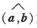

## 第一节向量及其线性运算
### 简单概念

> 矢量：既有大小又有方向的量
>两向量的夹角：规定以不超过π的角度为向量a，b的夹角,记作
>向量平行：终点和公共起点应在一条直线
>向量共面：起点放在同一点，如果k个终点和公共起点在一个平面上，就称这k个向量共面
>向量加减：省略
>
>
>
>
>
>
>
>
>

### 二级小节

左侧目录的二级。

## 第二个小节

- 列表项
- 列表项
